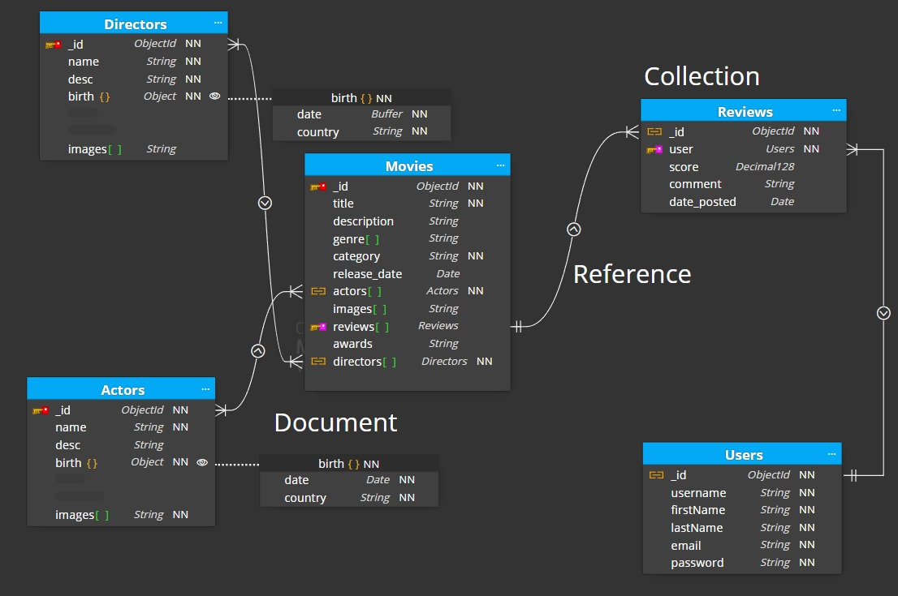

<p align="center">
 
 <h2 align="center">Kelompok 12 Pengembangan Aplikasi Web DTETI</h2>
 <p align="center">Tugas Membuat API CRUD</p>
</p>
<p align="center">
    <a href="https://github.com/grandiv/Tugas-2-PAW-Kelompok-12/graphs/contributors">
       
    </a>

<p align="center">
 
 <h2 align="center">This is Our Teams</h2>
 <p align="center">🧙‍♂️ Kami adalah mahasiswa Teknologi Informasi Anggkatan 2022 💻</p>
</p>

<p align="center">
 <p align="center">Flavia Hidayriamraata Pualam - 22/494376/TK/54219 </p>
 <p align="center">Muhammad Budi Setiawan - 22/505064/TK/55254</p>
 <p align="center">Muhammad Farrel Akbar - 22/492806/TK/53947</p>
 <p align="center">Muhammad Grandiv Lava Putra - 22/493242/TK/54023</p>
 <p align="center">Rani Nirmala Prakoso - 22/493982/TK/54153</p>
</p>

# Task Brief 🌱

* Dalam tugas ini, setiap kelompok yang telah dibagi sebelumnya diminta untuk membuat sebuah API CRUD sederhana dengan tema bebas. Aspek penilaian akan mencakup kebergunaan aplikasi, kerja sama tim (teamwork), repository kode (code repository), dan kinerja API yang dihasilkan.

* Selain itu, peserta diwajibkan menggunakan panduan resmi tentang git dalam proses pengerjaan, termasuk cara melakukan commit dan merge dengan baik dan benar. Seluruh proses kerja akan dinilai dari repository GitHub tersebut.

# Tugas Back End API CRUD Bertema Film 

* Kelompok 12 memilih untuk mengembangkan sebuah Aplikasi Web bertema film yang berfokus pada penyediaan informasi film secara lengkap dan interaktif. Aplikasi ini mengimplementasikan Back End APIs menggunakan ExpressJS yang terhubung dengan MongoDB sebagai database utama, untuk menyimpan dan mengelola data film secara efisien.

* Dari segi tampilan, aplikasi ini menghadirkan antarmuka Front End yang simpel namun intuitif, memprioritaskan kemudahan penggunaan (usability) sehingga pengguna dapat dengan mudah menavigasi dan mengakses informasi yang dibutuhkan. Selain itu, aplikasi juga mengedepankan fitur-fitur unggulan (utility) seperti pencarian, filter, dan pengelompokan film berdasarkan kategori, yang dirancang untuk memberikan pengalaman terbaik bagi pengguna.

# Tools Backend
    

# Tools Frontend
 

# Run Loccaly
To run a GitHub project locally:
1. Clone the repository:
   ```
   git clone https://github.com/grandiv/Tugas-2-PAW-Kelompok-12.git
   ```
2. Navigate into the project directory:
   ```
   cd Tugas-2-PAW-Kelompok-12
   ```
3. Install dependencies `npm install`.
4. Run the project menggunakan perintah `npm run start`.


# Use Case API dan Fitur-fitur Front-End

- CRUD Actor
- CRUD Director
- CRUD Movie 
- CRUD Review
- CRUD User
- Register dengan hashing
- Login dengan authentication JWT
- Penambahan beberapa gambar daring untuk setiap entitas Actor, Director, dan Movie 
- Penambahan Review untuk sebuah Movie tertentu
- Pemilihan Actor dan Director tertentu saat menambahkan sebuah Movie

# Proses Login dan Security
1. User input email dan password.
2. User submit login form.
3. Backend mencocokkan email dan hashed password yang disimpan di database.
4. Backend menghasilkan authToken (misalnya JWT) dan mengirimkannya ke frontend dalam HttpOnly & Secure cookies yang berlaku selama 1 jam.
5. Frontend menyimpan authToken di cookies dengan flag HttpOnly dan Secure, mencegah akses oleh JavaScript.
6. Saat mengakses protected page, frontend mengirimkan cookies ke backend. Backend memvalidasi authToken. Jika valid, halaman bisa diakses. Jika tidak valid (token kadaluarsa atau tidak cocok), user diarahkan ke halaman login.
(Opsional) Refresh token disimpan untuk memperbarui authToken tanpa login ulang jika sesi habis.

# MovieDB - Entity Relationship Diagram untuk MongoDB
<p align="center">
 
</p>

Dokumentasi ini menjelaskan skema NoSQL untuk basis data film yang diimplementasikan menggunakan MongoDB. Berikut penjelasan lebih lanjut:

## Relasi Antar Koleksi
1. Actors dan Directors memiliki referensi langsung ke film melalui koleksi Movies.
2. Reviews memiliki referensi ke Users yang menulis ulasan.
3. Movies memiliki referensi ke Reviews, Actors, dan Directors.

## Catatan Tambahan
1. NN: Not Null (Tidak Boleh Kosong).
2. ObjectId: ID unik yang dihasilkan MongoDB secara otomatis.
3. Struktur database ini menggunakan referensi antar dokumen untuk menjaga integritas data dan efisiensi pencarian informasi terkait film, aktor, sutradara, dan ulasan.

# Milestone 🚀 #

| Nama Kegiatan | Deskripsi Kegiatan | Tanggal|
|----|----|----|
| `diagram_schema`| Membuat skema database untuk NOSQL | 12 September 2024|
| `route`| Membuat route code | 18 September 2024|
| `controllers`| Membuat controllers code| 22 September 2024|
| `middlewares`| Membuat middlewares code| 22 September 2024|
| `frontend`| Membuat tampilan frontend untuk user interface| 23 September 2024|
| `testing1`| Percobaan apakah sistem berjalan pertama kali| 23 September 2024|
| `demo`| Melakukan video demonstrasi| 24 September 2024|
| `submitting_assignment`| Mengumpulkan hasil pekerjaan melalui email| 24 September 2024|

<hr>
<p align="center">
Developed with ❤️ in Indonesia (IDN)
</p>
